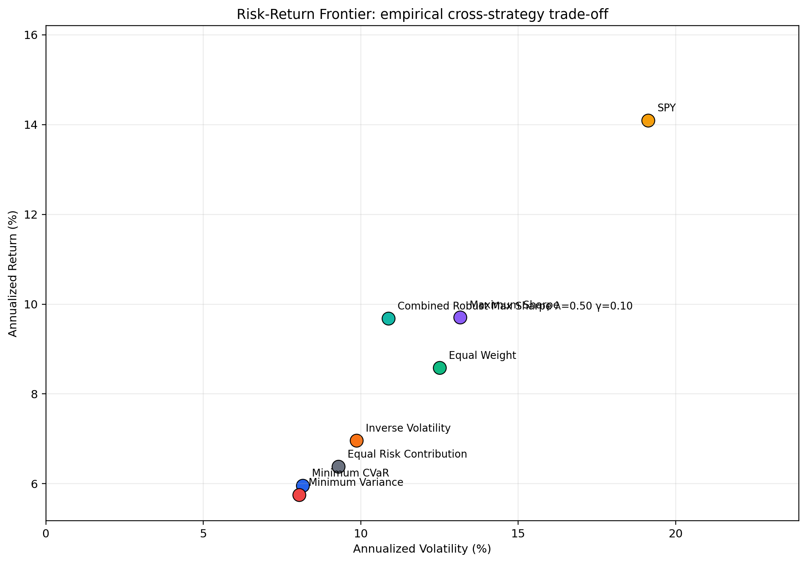

# PortfolioLab

PortfolioLab builds and validates constrained portfolio strategies under leakage-safe walk-forward testing, risk decomposition, and tail-risk optimization using frozen canonical data and reproducibility checks.

Quantitative Portfolio Research · Optimization · Factor Attribution · Tail Risk · Reproducibility

PortfolioLab is a financial-engineering research system for portfolio optimization, factor attribution, downside-risk measurement, and empirical validation. It is designed to be credible to recruiters, quantitative researchers, and software engineers because the code and the evidence are tied to a strict canonical-data contract and to repeatable verification artifacts rather than a single polished narrative.

[Research](#research-highlights) · [Source](src) · [M7 Report](results/milestone7_canonical/MILESTONE_7_RESEARCH_REPORT.md) · [M8 Report](results/milestone8_canonical/MILESTONE_8_RESEARCH_REPORT.md) · [Reproducibility](REPRODUCIBILITY.md)



*Figure: M8 risk-return frontier on the certified eight-strategy comparison set. SPY delivered the highest observed annualized return, while the Combined Robust Max Sharpe λ=0.50 γ=0.10 strategy delivered the strongest observed Sharpe and Sortino.*

## Research Highlights

1. M7 deterministic empirical execution is certified: 67 eligible rebalances, 67 optimizer calls, 0 optimizer failures, and 0 live-data calls. The canonical run produced matching artifacts under repeated execution.
2. M7 downside behavior is stronger than most competitors: Minimum CVaR achieved a maximum drawdown of approximately -21.22% and ranked first among the eight-strategy comparison set on that metric.
3. M7 realized tail-risk was more nuanced: Minimum CVaR ranked second on realized 95% VaR and 95% CVaR, while Minimum Variance ranked first. This is an important result: tail-loss optimization in the training sample did not automatically produce the lowest realized future tail loss.
4. M4 robust optimization showed a meaningful risk-adjusted result: Combined Robust Max Sharpe reached a canonical gross Sharpe of approximately 0.706 versus approximately 0.585 for classical Maximum Sharpe, while keeping turnover materially lower.

The strongest takeaway is not universal superiority. The evidence supports a more disciplined message: PortfolioLab investigates where optimization behaves well, where it breaks down, and which design choices trade growth, risk, and implementation realism against one another.

### M8 research synthesis

M8 is a certified cross-strategy synthesis of the validated PortfolioLab evidence across return, volatility, risk-adjusted performance, drawdown, tail risk, turnover, transaction costs, stress behavior, robustness, and factor context. It does not introduce a new optimizer or a new empirical strategy set; it consolidates the certified evidence already established in the previous milestones into a single public-facing synthesis.

The core M8 conclusion is that portfolio construction is a multi-objective trade-off rather than a single-strategy ranking: SPY produced the highest observed annualized return at 14.0891%, the Combined Robust Max Sharpe λ=0.50 γ=0.10 strategy produced the strongest observed Sharpe and Sortino at 0.705538 and 0.684938, Minimum CVaR produced the shallowest full-period maximum drawdown at -21.2206%, and Minimum Variance produced the lowest realized 95% VaR and 95% CVaR at 0.7798% and 1.1489%. The evidence also shows that the optimization objective and the subsequently realized out-of-sample tail-loss outcome are not identical: Minimum CVaR did not produce the lowest realized OOS 95% CVaR, while Minimum Variance was slightly lower in the certified sample.

This framing is intentionally evidence-first: M8 identifies portfolio personalities and trade-offs rather than a universal winner.

## What PortfolioLab Does

### Portfolio Construction

- Equal Weight
- Minimum Variance
- Maximum Sharpe
- shrinkage / robust variants
- turnover-aware optimization
- Inverse Volatility
- Equal Risk Contribution
- Minimum CVaR

### Risk & Tail Analytics

- volatility
- drawdown
- Sharpe / Sortino
- VaR
- CVaR
- stress analysis
- turnover
- transaction-cost drag
- concentration

### Factor Research

- CAPM
- FF3
- FF5
- FF5 + Momentum
- HAC inference
- Benjamini-Hochberg correction
- rolling factor exposures
- stress attribution

### Research Engineering

- leakage-controlled walk-forward evaluation
- frozen canonical datasets
- deterministic artifact generation
- hash verification
- anti-lookahead checks
- numerical invariant tests
- repeated-run parity

## Research Progression

| Milestone | Focus | Status |
| --- | --- | --- |
| M1 | Classical portfolio optimization foundation | Complete |
| M2 | Leakage-aware out-of-sample evaluation | Complete |
| M3 | Robust and turnover-aware optimization | Certified |
| M4 | Risk-based allocation and turnover control | Certified |
| M5 | Factor attribution and rolling exposure research | Certified |
| M6 / M6-T | TERM/CREDIT factor-extension branch | Blocked |
| M7 | Minimum-CVaR and realized downside-risk research | Certified |
| Repository Presentation Checkpoint | Current README and project presentation state | Current |
| M8 | Cross-strategy synthesis across return, volatility, drawdown, tail risk, turnover, transaction costs, stress behavior, robustness, and factor context | CERTIFIED |
| M9 | Interactive PortfolioLab analytics / dashboard layer | NEXT / FUTURE |

M6 / M6-T remains blocked: an attempted TERM/CREDIT extension under the project’s locked canonical-data and reproducibility contract could not satisfy the required evidence standard, so the branch was intentionally not forced to completion.

This is a deliberate research-standard choice rather than a failure of the platform: PortfolioLab enforces the evidence contract even when that prevents a milestone from being declared complete.

## Engineering & Research Architecture

PortfolioLab follows a modular workflow that separates data integrity, optimization logic, backtesting, risk analysis, factor research, and validation. The architecture is explicit and testable rather than hidden inside a monolithic notebook.

```text
Canonical Data
  ↓
src/optimization
  ↓
src/backtesting
  ↓
src/risk
  ↓
src/factors
  ↓
Canonical Empirical Artifacts
  ↓
Verification + Research Reports
```

The repository is organized around concrete modules:

- [src/optimization](src/optimization) for portfolio construction, robust optimization, and CVaR logic
- [src/backtesting](src/backtesting) for walk-forward evaluation and benchmark comparison
- [src/risk](src/risk) for downside metrics, VaR/CVaR, and stress analytics
- [src/factors](src/factors) for factor models, rolling exposures, and attribution logic
- [src/reproducibility](src/reproducibility) for deterministic validation and canonical reproducibility checks

This structure matters because it allows the project to separate what is a portfolio construction decision from what is a measurement decision from what is a validation decision.

## Validation & Reproducibility

Validation is a major differentiator for PortfolioLab. The project is designed around frozen canonical inputs, repeated-run parity checks, anti-lookahead protections, deterministic artifact generation, and numerical invariant validation. The goal is to make the empirical workflow reproducible before any performance story is interpreted.

The evidence is stronger than a generic research project because it includes artifact verification, canonical data manifests, and explicit checks that no live-data calls are made during certified runs. Implementation reproducibility means frozen inputs can reproduce the same outputs. It does not mean the strategy will outperform in future markets or that a result is economically universal.

The research workflow enforces this distinction explicitly: deterministic execution is a code-quality and methodology property; realized investment performance remains a sample-specific empirical question.

### Factor Data and Milestone 5

Milestone 5 uses daily Fama/French five-factor data plus the separate daily momentum series from the Kenneth R. French Data Library. The public repository intentionally does not redistribute the original raw archives or the reconstructed canonical factor CSV. Instead, PortfolioLab keeps the provenance metadata, expected hashes, acquisition/build logic, and derived research outputs in the repo so the research remains transparent without distributing the third-party source data itself.

Users who wish to reproduce the M5-specific factor pipeline should obtain the official source archives from the Data Library and construct the canonical factor dataset before running the M5-dependent tests. The source acquisition and canonical build logic are implemented in [src/factors/data.py](src/factors/data.py), with provenance and hash metadata stored in [data/canonical_factors/factor_manifest.json](data/canonical_factors/factor_manifest.json) and [data/canonical_factors/source_metadata.json](data/canonical_factors/source_metadata.json).

## Selected Research

- [M8 Research Report](results/milestone8_canonical/MILESTONE_8_RESEARCH_REPORT.md) — certified cross-strategy synthesis of return, risk, stress behavior, cost drag, and factor context
- [M7 Research Report](results/milestone7_canonical/MILESTONE_7_RESEARCH_REPORT.md) — flagship minimum-CVaR and downside-risk analysis
- [M4 Research Report](results/milestone4_canonical/MILESTONE_4_REPORT.md) — risk-based allocation and turnover control
- [M5 Canonical Factor Research](results/milestone5_canonical) — rolling factor exposures, stress attribution, and alpha diagnostics
- [Reproducibility Documentation](REPRODUCIBILITY.md) — canonical-data and repeatability checks
- [M3 Report](MILESTONE_3_REPORT.md) — robust optimization and turnover-aware construction
- [M2 Report](MILESTONE_2_REPORT.md) — leakage-safe out-of-sample workflow

## Repository Navigation

| Want to inspect | Location |
| --- | --- |
| Portfolio optimization | [src/optimization](src/optimization) |
| Walk-forward backtesting | [src/backtesting](src/backtesting) |
| Risk and tail metrics | [src/risk](src/risk) |
| Factor attribution and stress analysis | [src/factors](src/factors) |
| Reproducibility workflows | [src/reproducibility](src/reproducibility) |
| Tests | [tests](tests) |
| Canonical outputs | [results](results) |
| Flagship M7 report | [results/milestone7_canonical/MILESTONE_7_RESEARCH_REPORT.md](results/milestone7_canonical/MILESTONE_7_RESEARCH_REPORT.md) |
| Supporting M4 report | [results/milestone4_canonical/MILESTONE_4_REPORT.md](results/milestone4_canonical/MILESTONE_4_REPORT.md) |

## Quick Start

### Core setup

```bash
git clone <repository-url>
cd PortfolioLab
python -m venv .venv
source .venv/bin/activate
pip install -r requirements.txt
```

### Factor-data note (Milestone 5)

Milestone 5 uses a frozen, hash-certified factor snapshot. The public code documents and reproduces the acquisition and transformation pipeline in [src/factors/data.py](src/factors/data.py), but current Kenneth R. French archives may not reproduce the certified snapshot byte-for-byte because the upstream factor series can be revised over time.

The repository does not redistribute the official Fama/French Daily source archives or the reconstructed canonical factor CSV. See [REPRODUCIBILITY.md](REPRODUCIBILITY.md) for the exact provenance contract, including the frozen date range, row count, schema, and SHA256.

The supported acquisition/build interface is the Python API exposed by `build_canonical_factor_dataset(...)` in [src/factors/data.py](src/factors/data.py). No public one-command factor build script is currently provided.

```python
from src.factors.data import build_canonical_factor_dataset
build_canonical_factor_dataset("data/canonical_factors")
```

This is the supported path for constructing the daily canonical factor dataset used by the M5 pipeline.

### Validation

PortfolioLab distinguishes between public/core validation and historical frozen-snapshot certification.

Public/core validation (does not require the excluded frozen M5 canonical factor snapshot):

```bash
python -m pytest -m "not frozen_snapshot" -q
```

Historical frozen-snapshot certification (requires the exact locally supplied M5 snapshot):

```bash
python -m pytest -m frozen_snapshot -q
```

Full local certification when the exact frozen snapshot is present:

```bash
python -m pytest tests/ -q
```

The public repository intentionally does not redistribute the exact frozen M5 canonical factor CSV or the raw Kenneth R. French archives. The factor-data requirement is therefore specific to the Milestone 5 factor-analysis path and is explicitly separated from the public/core test path.

Preflight capability check:

```bash
python -m src.reproducibility.preflight
```

This reports whether the current environment supports public validation, frozen M5 snapshot validation, and full local certification without downloading anything or modifying canonical outputs.

For milestone-specific canonical execution on the non-factor side of the project, the repository also includes explicit entry points such as:

```bash
python run_milestone4_canonical_evaluation.py
python run_reproducibility_milestone.py
```

These commands are supported by the repository structure and the canonical artifact workflow, while the empirical results remain documented in the milestone reports and validation artifacts rather than hidden in a friendly wrapper.

## Roadmap

- M1–M5: research foundation complete
- M6 / M6-T: blocked research branch under the locked data and reproducibility contract
- M7: certified minimum-CVaR research milestone
- Repository Presentation Checkpoint: current
- M8: CERTIFIED cross-strategy synthesis
- M9: NEXT / FUTURE interactive PortfolioLab analytics / dashboard layer

The project is not presented as a finished product in every dimension. It is presented as a serious quantitative-research codebase with a validated research core, explicit evidence standards, and a clear path for deeper synthesis and user-facing analytics.
