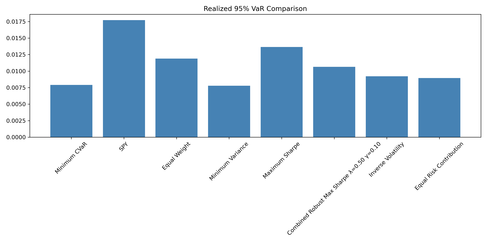
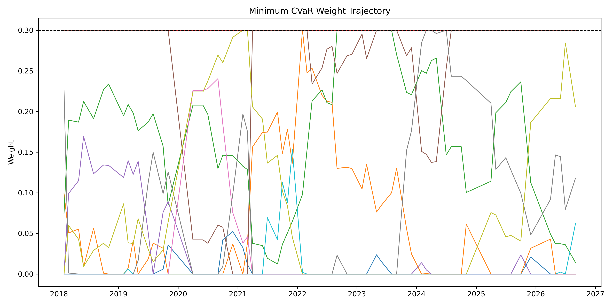
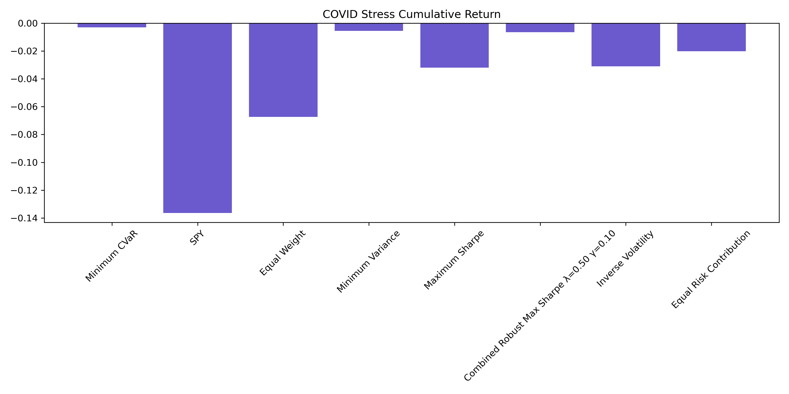
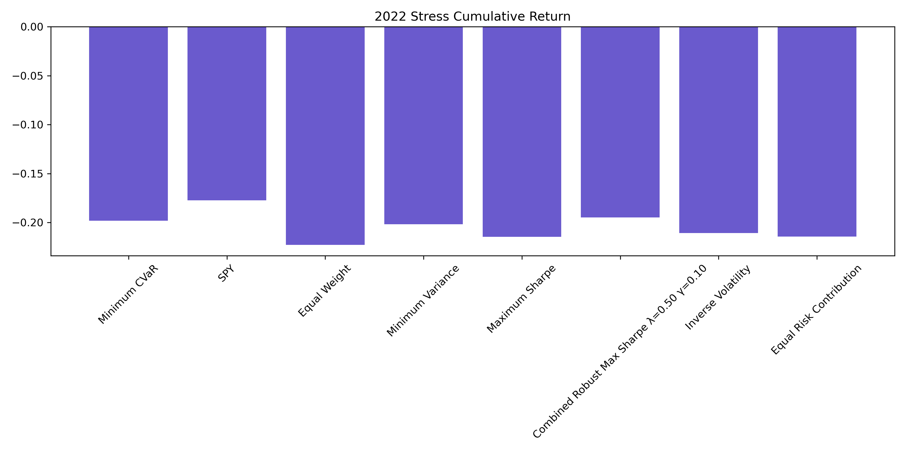
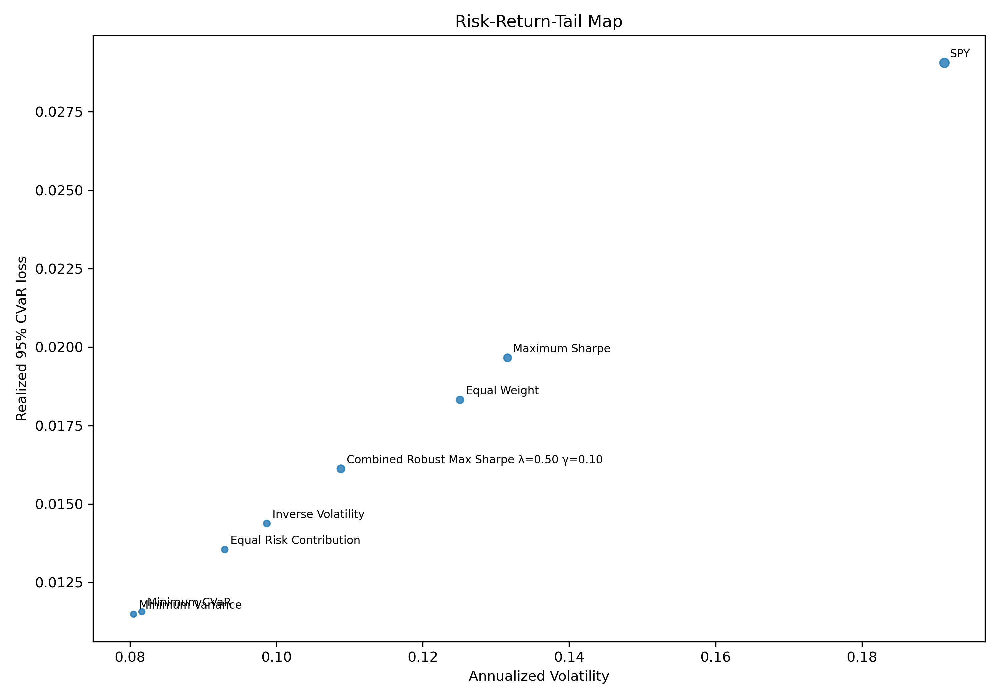
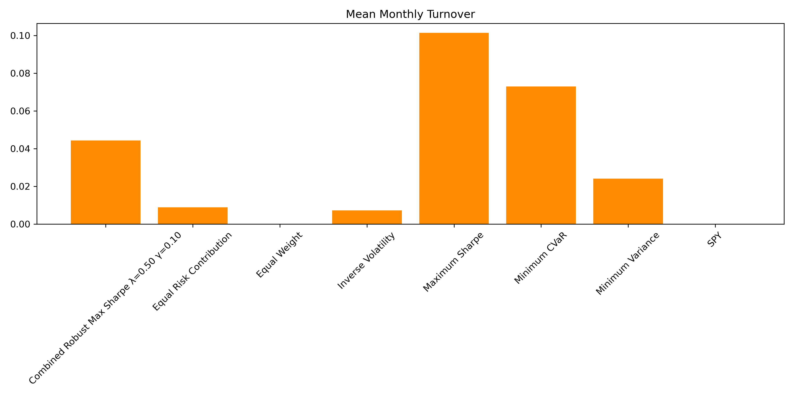
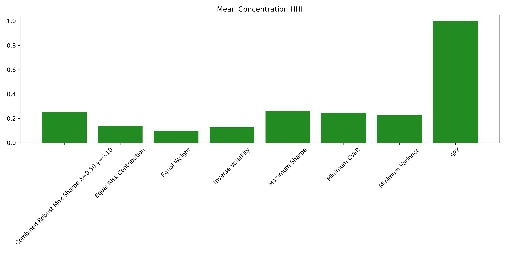

# Downside Protection Without Illusions

## A Reproducible Out-of-Sample Study of Minimum-CVaR Portfolio Optimization

PortfolioLab — Milestone 7

## 1. Executive Summary

Milestone 7 tests a narrow but important financial-engineering claim: can historical 95% Minimum-CVaR optimization provide meaningful realized out-of-sample downside protection relative to traditional and risk-based portfolio construction methods? The experiment is intentionally sealed. It uses a frozen ten-ETF universe, exactly 252 trailing observations at each rebalance, monthly walk-forward optimization, long-only fully invested portfolios, a 30% position cap, an eight-strategy comparison universe, and a locked transaction-cost grid. Nothing in the empirical design was tuned after results were observed.

The trust basis is architectural before it is empirical. Certified execution in [milestone7_empirical_verification.json](milestone7_empirical_verification.json) records 67 eligible rebalances, 67 optimizer calls, zero optimizer failures, zero live-data calls, anti-lookahead protections, deterministic artifact generation, and an independent second canonical run with matching certified artifact hashes and zero numeric differences across the compared CSV outputs. This is not a one-off optimization notebook. It is a frozen, reproducible research pipeline whose mechanics were validated before performance was inspected.

The headline result is strong but not promotional. Minimum CVaR delivered a gross CAGR of about 5.95%, a realized 95% VaR of about 0.7901%, and a realized 95% CVaR of about 1.1566% over the common out-of-sample interval from 2018-02-01 through 2026-09-02. Those tail metrics ranked 2 of 8 in the certified benchmark universe. The surprise is that [Minimum Variance](portfolio_metrics_gross.csv), which does not explicitly optimize tail loss, ranked first on both realized 95% VaR and realized 95% CVaR. The different win for Minimum CVaR was pathwise rather than universal: it achieved the best maximum drawdown at about -21.22%, ranking 1 of 8. It also showed notable stress resilience, especially in the locked 2022 regime.

That combination leads to the real research lesson. Explicitly minimizing historical training-sample tail loss did not guarantee the lowest future realized tail loss. Minimum CVaR behaved as a specialized defensive allocator rather than as a universally superior optimizer. It protected the downside more effectively than most benchmarks, but it also sacrificed substantial long-run growth relative to higher-return alternatives such as SPY, whose gross CAGR was about 14.09%, as well as Maximum Sharpe and Combined Robust Max Sharpe. Within this frozen sample, the evidence points to a defense-growth tradeoff rather than a winner-take-all ranking.

## 2. Research Question & Experimental Design

PortfolioLab reached Milestone 7 only after classical mean-variance construction, walk-forward testing, robust optimization, and risk-based construction had already been built and audited in [../../MILESTONE_2_REPORT.md](../../MILESTONE_2_REPORT.md), [../../MILESTONE_3_REPORT.md](../../MILESTONE_3_REPORT.md), and [../milestone4_canonical/MILESTONE_4_REPORT.md](../milestone4_canonical/MILESTONE_4_REPORT.md). M7 exists because variance does not fully answer the risk question relevant to tail events. Variance penalizes total dispersion, whether it comes from gains or losses. CVaR instead focuses directly on the loss tail. The milestone therefore asks whether explicit tail-loss optimization produces a meaningfully different and economically useful out-of-sample defense.

The certified experiment uses the frozen canonical ETF universe from [../../data/canonical/canonical_returns.csv](../../data/canonical/canonical_returns.csv): GLD, EFA, IWM, VNQ, EEM, SPY, TLT, LQD, QQQ, and IEF. The benchmark universe is not arbitrary. SPY is the single-asset market benchmark. Equal Weight is the naive diversification baseline. Minimum Variance is the traditional risk-minimization benchmark. Maximum Sharpe represents return-seeking mean-variance optimization. Combined Robust Max Sharpe carries forward the more sophisticated robust construction from the earlier PortfolioLab research. Inverse Volatility and Equal Risk Contribution are simpler risk-based methods that test whether additional optimizer complexity actually earns its keep. Minimum CVaR is the new tail-risk strategy introduced in M7.

The comparison interval is the exact intersection between valid Minimum-CVaR out-of-sample dates and the frozen benchmark out-of-sample dates: 2018-02-01 through 2026-09-02, with 2,158 daily observations, as certified in [milestone7_empirical_verification.json](milestone7_empirical_verification.json). At each eligible monthly rebalance, the strategy uses exactly the latest 252 valid daily observations, solves a long-only fully invested Minimum-CVaR problem with a 30% cap, freezes the weights through the holding interval, and then applies a locked transaction-cost grid of 0, 5, 10, and 25 basis points. The primary net implementation comparison uses 10 bps.

Two locked stress periods complement the full-sample evidence: COVID from 2020-02-20 through 2020-04-30, and the 2022 drawdown regime from 2022-01-03 through 2022-10-31. Their purpose is not to override the full-sample tail metrics, but to show whether the same optimizer behaves differently under abrupt crisis conditions and under a more prolonged adverse regime.

### Engineering Contribution

Milestone 7 is implemented as a deterministic research pipeline rather than as a one-off portfolio experiment. The architecture explicitly separates tail-risk measurement, CVaR optimization, walk-forward execution, empirical evaluation, validation, artifact generation, and reproducibility verification. That separation is visible in the production modules [../../src/risk/tail_metrics.py](../../src/risk/tail_metrics.py), [../../src/optimization/cvar.py](../../src/optimization/cvar.py), [../../src/backtesting/milestone7.py](../../src/backtesting/milestone7.py), and [../../src/backtesting/milestone7_empirical.py](../../src/backtesting/milestone7_empirical.py), and it is certified in the frozen artifact record.

The most recruiter-relevant evidence is concrete. The canonical run completed 67 eligible rebalances with 67 optimizer calls, zero optimizer failures, and zero live-data dependency. The walk-forward mechanics were tested for anti-lookahead behavior and future-mutation invariance. The empirical study was then executed twice independently, producing matching certified artifact hashes and zero numeric differences across the compared CSV outputs. In other words, M7 is simultaneously a portfolio-optimization project, a validation-heavy software-engineering project, and a reproducible empirical research project.

## 3. CVaR Mathematics & Portfolio Construction

The implementation begins with daily asset returns $r_t \in \mathbb{R}^N$ and portfolio weights $w \in \mathbb{R}^N$. The portfolio return on day $t$ is

$$
r_{p,t} = w^\top r_t.
$$

This matches the return construction used in [../../src/backtesting/milestone7.py](../../src/backtesting/milestone7.py), where the holding-period portfolio return is computed by multiplying the asset-return matrix by the frozen rebalance weight vector.

Milestone 7 uses the canonical loss definition

$$
L_t(w) = -w^\top r_t.
$$

Gains therefore appear as negative losses, and no clipping is applied to the loss sample. This sign convention is enforced in both [../../src/risk/tail_metrics.py](../../src/risk/tail_metrics.py) and [../../src/optimization/cvar.py](../../src/optimization/cvar.py). For a finite loss sample $L_1, \dots, L_T$, empirical VaR at confidence level $\alpha$ is the deterministic right-continuous order statistic

$$
\operatorname{VaR}_\alpha(L) = L_{(\lceil \alpha T \rceil)}.
$$

The critical M7 choice is the CVaR definition. The production implementation does not use a generic strict-tail average when that would differ at VaR ties. Instead, it uses the Rockafellar-Uryasev finite-sample value

$$
\operatorname{CVaR}_\alpha(L)
=
\min_{\zeta}
\left[
\zeta + \frac{1}{(1-\alpha)T} \sum_{t=1}^{T} \max(L_t - \zeta, 0)
\right].
$$

This is the same mathematical object used for standalone measurement in [../../src/risk/tail_metrics.py](../../src/risk/tail_metrics.py), for the optimizer objective in [../../src/optimization/cvar.py](../../src/optimization/cvar.py), and for the empirical interpretation in [../../src/backtesting/milestone7_empirical.py](../../src/backtesting/milestone7_empirical.py). The auxiliary variable $\zeta$ should be interpreted as a VaR-threshold variable. It need not be unique for the objective value to be valid.

The optimization problem becomes a tractable linear program by introducing scenario slack variables $u_t$:

$$
\min_{w,\zeta,u}
\left[
\zeta + \frac{1}{(1-\alpha)T} \sum_{t=1}^{T} u_t
\right]
$$

subject to

$$
u_t \ge L_t(w) - \zeta, \qquad u_t \ge 0,
$$

$$
\sum_{i=1}^{N} w_i = 1,
$$

$$
0 \le w_i \le 0.30.
$$

That is the exact program assembled in [../../src/optimization/cvar.py](../../src/optimization/cvar.py), which solves the problem with SciPy's `linprog` using the HiGHS backend and then validates post-solution feasibility, objective agreement, and constraint satisfaction.

The rest of the implementation contract is equally explicit. Turnover at rebalance date $t$ is

$$
\tau_t = \frac{1}{2} \sum_{i=1}^{N} |w_{i,t} - w_{i,t-1}|,
$$

matching both [../../src/backtesting/milestone7.py](../../src/backtesting/milestone7.py) and the turnover summaries built in [../../src/backtesting/milestone7_empirical.py](../../src/backtesting/milestone7_empirical.py). Transaction costs are applied only on the first day of a holding interval after a non-initial rebalance:

$$
r^{\text{net}}_{p,t_0} = r^{\text{gross}}_{p,t_0} - \tau_t c,
$$

where $c$ is the cost rate in decimal form. This is not a hidden penalty inside the optimization objective; it is a post-trade implementation adjustment.

For evaluation, the report uses the same production formulas as the code. Maximum drawdown is the minimum wealth decline from the running peak,

$$
\operatorname{MDD} = \min_t \left(\frac{W_t}{\max_{s \le t} W_s} - 1\right),
$$

Sortino is computed from annualized return minus the 2% risk-free rate divided by annualized downside deviation based only on negative returns, and Calmar is annualized return divided by the absolute maximum drawdown. Concentration is summarized with the Herfindahl-Hirschman Index,

$$
\operatorname{HHI}_t = \sum_{i=1}^{N} w_{i,t}^2,
$$

and effective holdings are its reciprocal,

$$
N_{\text{eff},t} = \frac{1}{\operatorname{HHI}_t}.
$$

These equations matter because the report's argument rests on the idea that a tail-risk optimizer should be judged not only by its objective function, but by the concrete portfolio behavior that objective produces.

## 4. Validation & Reproducibility

PortfolioLab did not inspect M7 performance immediately after writing an optimizer. The research was staged so that empirical claims came last. Phase 0 locked the mathematical and repository contract. Phase 1 validated the finite-sample tail metrics in [../../tests/test_tail_metrics.py](../../tests/test_tail_metrics.py), including tie behavior at the VaR threshold and the distinction between the Rockafellar-Uryasev definition and a strict-tail average. Phase 2 validated the optimizer in [../../tests/test_cvar_optimization.py](../../tests/test_cvar_optimization.py), including metric-objective agreement, post-solution feasibility, and clear failure handling. Phase 3 validated walk-forward mechanics in [../../tests/test_milestone7_mechanics.py](../../tests/test_milestone7_mechanics.py), including exact 252-observation windows, anti-lookahead rules, future-mutation invariance, return-construction identities, and deterministic repetition. Phase 4 then executed the empirical study and its reproducibility contract in [../../tests/test_milestone7_empirical.py](../../tests/test_milestone7_empirical.py).

This sequencing matters because performance was inspected only after the experiment had already been constrained to be leakage-safe, deterministic, and mathematically consistent. The certified verification record in [milestone7_empirical_verification.json](milestone7_empirical_verification.json) reports 67 eligible rebalances, 67 optimizer calls, zero optimizer failures, and zero live-data calls. Constraint quality was effectively at machine precision: maximum weight-sum error $3.9968028886505635 \times 10^{-15}$, maximum lower-bound violation $0.0$, maximum upper-bound violation $0.0$, maximum Rockafellar-Uryasev scenario-constraint violation $1.6523241108679088 \times 10^{-16}$, and maximum metric-objective CVaR difference $0.0$. The minimum and maximum optimized $\zeta$ values were about 0.3020% and 0.9968%, and mean ex-ante training CVaR was about 0.9244%.

The reproducibility contract is just as important, but it should not be overstated. Canonical reproducibility in PortfolioLab means deterministic re-execution under frozen inputs, not proof that the economic model is universally correct. The public verification artifact in [milestone7_empirical_verification.json](milestone7_empirical_verification.json) records the complete artifact manifest, including hash checks for every certified CSV and figure output, and confirms that the generated outputs remain numerically stable under the locked research contract. That result is evidence of deterministic research infrastructure and reproducible implementation discipline.

### Table 7. Validation and reproducibility summary

| item | certified value |
| --- | ---: |
| comparison interval start | 2018-02-01 |
| comparison interval end | 2026-09-02 |
| out-of-sample observations | 2158 |
| training observations per rebalance | 252 |
| eligible rebalances | 67 |
| optimizer calls | 67 |
| optimizer failures | 0 |
| live-data calls | 0 |
| max weight-sum error | 3.9968028886505635e-15 |
| max lower-bound violation | 0.0 |
| max upper-bound violation | 0.0 |
| max RU scenario-constraint violation | 1.6523241108679088e-16 |
| max metric/objective CVaR difference | 0.0 |
| run-1 vs run-2 max numeric difference | 0.0 |
| run-1 vs run-2 certified hash parity | yes |

## 5. Out-of-Sample Results

The main out-of-sample message is simple but not simplistic. Minimum CVaR defended the downside well. It did not dominate the benchmark universe. Table 1 provides the primary hypothesis screen, and the following two cross-strategy tables show the minimum set of metrics needed to understand the result.

### Table 1. Hypothesis scorecard

| hypothesis | verdict | primary evidence | interpretation |
| --- | --- | --- | --- |
| H1A Tail-risk reduction | Not fully supported | Minimum CVaR ranked 2 of 8 on realized 95% VaR and 2 of 8 on realized 95% CVaR; Minimum Variance ranked 1 of 8 on both in gross and 10 bps net results. | Explicit tail-loss targeting did not guarantee the lowest future realized tail loss in this frozen sample. |
| H1B Drawdown resilience | Supported | Minimum CVaR produced the best maximum drawdown in gross and net comparisons. | The optimizer generated stronger pathwise drawdown protection than the rest of the benchmark universe. |
| H1C Downside-risk efficiency | Not supported | Minimum CVaR ranked 6 of 8 on Sortino, 6 of 8 on Calmar, and 7 of 8 on CAGR in both gross and net primary tables. | Defensive behavior did not translate into strong growth-adjusted efficiency. |
| H1D Locked stress-period performance | Supported overall | Minimum CVaR was exceptionally resilient in COVID and especially in 2022, but it did not dominate every individual stress metric. | Stress evidence supports a defensive profile, but not universal stress dominance. |
| H1E Return tradeoff | Supported | Minimum CVaR trailed SPY, Maximum Sharpe, Combined Robust, Equal Weight, Inverse Volatility, and Equal Risk Contribution on CAGR and terminal wealth. | The realized evidence reveals a defense-growth tradeoff rather than universal superiority. |

### Table 2. Primary gross out-of-sample results

| strategy | CAGR | ann. vol. | Sortino | max drawdown | Calmar | realized 95% VaR | realized 95% CVaR | rank VaR95 | rank CVaR95 | rank max drawdown |
| --- | ---: | ---: | ---: | ---: | ---: | ---: | ---: | ---: | ---: | ---: |
| Minimum CVaR | 0.059540 | 0.081614 | 0.463997 | -0.212206 | 0.280579 | 0.007901 | 0.011566 | 2 | 2 | 1 |
| SPY | 0.140891 | 0.191280 | 0.594807 | -0.337173 | 0.417860 | 0.017710 | 0.029058 | 8 | 8 | 8 |
| Equal Weight | 0.085794 | 0.125086 | 0.495136 | -0.255194 | 0.336193 | 0.011895 | 0.018318 | 6 | 6 | 6 |
| Minimum Variance | 0.057471 | 0.080486 | 0.447203 | -0.221996 | 0.258885 | 0.007798 | 0.011489 | 1 | 1 | 2 |
| Maximum Sharpe | 0.097030 | 0.131589 | 0.553651 | -0.255800 | 0.379322 | 0.013660 | 0.019658 | 7 | 7 | 7 |
| Combined Robust Max Sharpe λ=0.50 γ=0.10 | 0.096777 | 0.108820 | 0.684938 | -0.223658 | 0.432700 | 0.010645 | 0.016120 | 5 | 5 | 3 |
| Inverse Volatility | 0.069586 | 0.098693 | 0.471943 | -0.235633 | 0.295316 | 0.009226 | 0.014378 | 4 | 4 | 4 |
| Equal Risk Contribution | 0.063781 | 0.092940 | 0.443458 | -0.237624 | 0.268412 | 0.008957 | 0.013547 | 3 | 3 | 5 |

### Table 3. Primary net results at 10 bps

| strategy | CAGR | ann. vol. | Sortino | max drawdown | Calmar | realized 95% VaR | realized 95% CVaR | rank VaR95 | rank CVaR95 | rank max drawdown |
| --- | ---: | ---: | ---: | ---: | ---: | ---: | ---: | ---: | ---: | ---: |
| Minimum CVaR | 0.058936 | 0.081610 | 0.456762 | -0.212594 | 0.277225 | 0.007901 | 0.011568 | 2 | 2 | 1 |
| SPY | 0.140891 | 0.191280 | 0.594807 | -0.337173 | 0.417860 | 0.017710 | 0.029058 | 8 | 8 | 8 |
| Equal Weight | 0.085794 | 0.125086 | 0.495136 | -0.255194 | 0.336193 | 0.011895 | 0.018318 | 6 | 6 | 6 |
| Minimum Variance | 0.057272 | 0.080487 | 0.444756 | -0.222105 | 0.257859 | 0.007798 | 0.011490 | 1 | 1 | 2 |
| Maximum Sharpe | 0.096161 | 0.131588 | 0.547596 | -0.256324 | 0.375154 | 0.013660 | 0.019658 | 7 | 7 | 7 |
| Combined Robust Max Sharpe λ=0.50 γ=0.10 | 0.096396 | 0.108824 | 0.681449 | -0.224071 | 0.430200 | 0.010645 | 0.016120 | 5 | 5 | 3 |
| Inverse Volatility | 0.069526 | 0.098695 | 0.471333 | -0.235657 | 0.295028 | 0.009226 | 0.014380 | 4 | 4 | 4 |
| Equal Risk Contribution | 0.063707 | 0.092942 | 0.442671 | -0.237650 | 0.268070 | 0.008957 | 0.013549 | 3 | 3 | 5 |

The certified realized VaR figure provides a useful first visual summary, but it should be read narrowly.

*Figure 1. Certified realized 95% VaR comparison. The file name is a legacy artifact label, but the plotted quantity is realized 95% VaR loss only. It shows that Minimum Variance and Minimum CVaR cluster closely at the safest end of the benchmark set. The reader should not infer that this figure, by itself, establishes the full CVaR ranking; the corresponding CVaR evidence comes from the certified metric tables.*

## 6. Why Minimum Variance Beat Minimum CVaR on Realized Tail Loss

This is the key intellectual result of Milestone 7. The theoretical contrast is clear. Minimum Variance minimizes total return dispersion, whereas Minimum CVaR minimizes the Rockafellar-Uryasev value of the loss tail. They are different mathematical problems, and they reward different portfolio behaviors. If theory mapped cleanly into realized future rankings, one might expect Minimum CVaR to dominate Minimum Variance on realized tail-loss metrics.

That did not happen here. In gross results, Minimum Variance posted realized 95% VaR of about 0.7798% and realized 95% CVaR of about 1.1489%, while Minimum CVaR posted about 0.7901% and 1.1566%. The gaps were small but real: roughly 0.0103 percentage points on VaR and 0.0078 percentage points on CVaR, or about 1.03 and 0.78 basis points respectively. The same ranking survived at 10 bps net, where the realized 95% CVaR gap remained about 0.0078 percentage points. Descriptively, the same pattern extended to the 99% sensitivity metrics as well.

This is not a contradiction of the methodology. The optimizer minimizes historical training-sample CVaR, not realized future tail loss. The out-of-sample future can differ from the empirical scenario distribution used during training. In finite samples, tail events are sparse, the VaR threshold can be sensitive to a small number of observations, and portfolio constraints change the set of feasible responses. Minimum Variance can therefore remain highly competitive because a low-volatility, bond-heavy, cap-constrained portfolio can indirectly become very defensive in the realized tail even without directly minimizing the tail objective. The evidence supports that interpretation, but it does not license a stronger causal claim than the data can support.

The more interesting question is what additional form of defense Minimum CVaR produced. That answer is behavioral rather than purely rank-based. Minimum CVaR did not beat Minimum Variance on realized tail-loss ranks, but it did beat Minimum Variance on maximum drawdown, and it behaved differently through the stress windows and through its repeated interaction with the 30% cap.

### Table 4. Minimum CVaR versus Minimum Variance

| metric | Minimum CVaR gross | Minimum Variance gross | difference (M7 - MinVar) | Minimum CVaR net 10 bps | Minimum Variance net 10 bps |
| --- | ---: | ---: | ---: | ---: | ---: |
| CAGR | 0.059540 | 0.057471 | 0.002069 | 0.058936 | 0.057272 |
| annualized volatility | 0.081614 | 0.080486 | 0.001128 | 0.081610 | 0.080487 |
| Sortino | 0.463997 | 0.447203 | 0.016793 | 0.456762 | 0.444756 |
| max drawdown | -0.212206 | -0.221996 | 0.009790 | -0.212594 | -0.222105 |
| Calmar | 0.280579 | 0.258885 | 0.021694 | 0.277225 | 0.257859 |
| realized 95% VaR | 0.007901 | 0.007798 | 0.000103 | 0.007901 | 0.007798 |
| realized 95% CVaR | 0.011566 | 0.011489 | 0.000078 | 0.011568 | 0.011490 |
| realized 99% VaR | 0.012897 | 0.012586 | 0.000311 | 0.012897 | 0.012586 |
| realized 99% CVaR | 0.019622 | 0.019299 | 0.000323 | 0.019622 | 0.019299 |
| mean HHI | 0.248188 | 0.228390 | 0.019798 | 0.248188 | 0.228390 |
| mean effective holdings | 4.045994 | 4.409988 | -0.363994 | 4.045994 | 4.409988 |
| mean monthly turnover | 0.072966 | 0.024091 | 0.048875 | 0.072966 | 0.024091 |
| 10 bps cost drag | 0.007996 | 0.002604 | 0.005392 | 0.007996 | 0.002604 |

The portfolio-behavior contrast is visible in the certified weight-history figure.

*Figure 2. Certified Minimum-CVaR weight trajectory. The optimizer repeatedly leans into a small set of defensive assets and interacts frequently with the 30% cap. The reader should not infer that the line with the most cap interaction is necessarily the causal driver of the full performance profile; the figure is descriptive portfolio-behavior evidence, not a formal attribution model.*

## 7. Drawdown, Stress & the Return-Defense Tradeoff

The strongest argument for Minimum CVaR is not that it delivered the lowest realized full-sample VaR or CVaR. It did not. The strongest argument is that it produced the lowest maximum drawdown and a notably defensive profile in the locked stress windows. In gross terms, its maximum drawdown was about -21.22%, better than Minimum Variance at about -22.20%, Combined Robust at about -22.37%, and far better than SPY at about -33.72%. Drawdown and CVaR are related, but they are not identical. CVaR averages severity in the loss tail; maximum drawdown is a path-dependent peak-to-trough event. A strategy can therefore lose narrowly on tail-loss ranking while still winning on pathwise protection.

The COVID evidence shows one form of defense. Minimum CVaR posted the best cumulative return of the group at about -0.30%, versus about -0.56% for Minimum Variance, about -0.65% for Combined Robust, and about -13.64% for SPY. That said, it did not dominate every stress metric. Minimum Variance and Combined Robust had slightly smaller realized period CVaR values during COVID. The interpretation should therefore be restrained: Minimum CVaR was exceptionally resilient during the COVID shock, but not uniquely dominant across every COVID statistic.

The 2022 regime tells a different but complementary story. Minimum CVaR was not the best strategy on cumulative return; Combined Robust at about -19.49% and SPY at about -17.74% both ended the period ahead on that measure. But Minimum CVaR posted the lowest annualized volatility at about 10.45%, the best maximum drawdown at about -20.62%, the least severe worst day at about -2.44%, and the best realized period CVaR at about 1.3675%. That is exactly the kind of defensive stress profile a tail-risk optimizer hopes to produce, even if it does not maximize terminal wealth.

### Table 5. Locked stress-period comparison

| strategy | COVID cumulative return | COVID max drawdown | COVID period CVaR95 | 2022 cumulative return | 2022 max drawdown | 2022 period CVaR95 |
| --- | ---: | ---: | ---: | ---: | ---: | ---: |
| Minimum CVaR | -0.003039 | -0.149362 | 0.039186 | -0.198230 | -0.206230 | 0.013675 |
| SPY | -0.136407 | -0.334439 | 0.097659 | -0.177443 | -0.244964 | 0.034902 |
| Equal Weight | -0.067319 | -0.218684 | 0.066420 | -0.222830 | -0.248421 | 0.021837 |
| Minimum Variance | -0.005583 | -0.149356 | 0.038517 | -0.201753 | -0.209697 | 0.014382 |
| Maximum Sharpe | -0.031994 | -0.177489 | 0.048723 | -0.214599 | -0.245279 | 0.024476 |
| Combined Robust Max Sharpe λ=0.50 γ=0.10 | -0.006516 | -0.144038 | 0.037933 | -0.194944 | -0.211007 | 0.018547 |
| Inverse Volatility | -0.030944 | -0.174851 | 0.049107 | -0.210704 | -0.226372 | 0.017173 |
| Equal Risk Contribution | -0.020079 | -0.154401 | 0.043773 | -0.214494 | -0.226131 | 0.016304 |

*Figure 3. Certified COVID stress cumulative return comparison. Minimum CVaR lost the least over the locked COVID window. The figure shows only cumulative return, so it should not be read as a complete ranking of COVID volatility, drawdown, or period CVaR.*

*Figure 4. Certified 2022 stress cumulative return comparison. Minimum CVaR was not the top strategy on cumulative return in 2022, which is why the stress evidence must be interpreted jointly with volatility, drawdown, and period CVaR rather than as a single-number verdict.*

The broader economic tradeoff becomes clearest in the risk-return-tail map.

*Figure 5. Certified risk-return-tail map. The horizontal axis is annualized volatility, the vertical axis is realized 95% CVaR loss, and bubble size scales with annualized return. Minimum CVaR sits near Minimum Variance at the defensive end of the map, but with materially smaller growth than the higher-return strategies. The figure should not be interpreted as a universal efficiency frontier; it is a descriptive positioning map for this frozen sample only.*

The report's central economic judgment follows directly from these tables and figures: stronger defense came with weaker compounding. Minimum CVaR's gross CAGR was about 5.95%, versus about 9.68% for Combined Robust, about 9.70% for Maximum Sharpe, and about 14.09% for SPY. Its terminal wealth of 1.6409 trailed even Equal Weight at 2.0236. Within this sample, the evidence suggests that Minimum CVaR offered a distinct protective profile, but that profile was expensive in foregone growth.

## 8. Portfolio Behavior, Turnover & Transaction Costs

If Minimum CVaR is to justify its additional mathematical complexity, the portfolio it produces should look meaningfully different from both simpler risk-based portfolios and from return-seeking optimized portfolios. The certified artifacts show that it does. Mean concentration HHI was 0.2482, close to Combined Robust at 0.2514 and Maximum Sharpe at 0.2638, but far higher than Inverse Volatility at 0.1274 and Equal Risk Contribution at 0.1399. Mean effective holdings were only about 4.05, versus about 7.90 for Inverse Volatility and about 7.26 for Equal Risk Contribution. This was not a broadly diversified equal-risk portfolio. It was a concentrated defensive allocator.

The cap-interaction evidence is particularly revealing. Minimum CVaR had a 100% cap-hit frequency, with a maximum of three simultaneous capped positions. The assets most frequently at the cap were IEF in all 67 rebalances, LQD in 42, GLD in 8, SPY in 3, and TLT in 2. The [weight_stability.csv](weight_stability.csv) artifact shows that IEF had mean weight exactly 30.0% with effectively zero variability, while LQD averaged about 24.85% and also hit the cap frequently. That pattern is consistent with a strategy that repeatedly leaned on intermediate Treasuries and investment-grade credit as defensive anchors.

Turnover distinguishes Minimum CVaR both from simpler risk-based portfolios and from more aggressive optimized ones. Mean monthly turnover was about 7.30%. That was lower than Maximum Sharpe at about 10.14%, but much higher than Minimum Variance at about 2.41%, Combined Robust at about 4.44%, Inverse Volatility at about 0.72%, and Equal Risk Contribution at about 0.89%. In other words, Minimum CVaR was not only more concentrated than IV and ERC; it was also far more active.

### Table 6. Portfolio behavior, concentration, and turnover

| strategy | mean HHI | mean effective holdings | cap-hit frequency | max simultaneous capped positions | mean monthly turnover | annualized turnover |
| --- | ---: | ---: | ---: | ---: | ---: | ---: |
| Minimum CVaR | 0.248188 | 4.045994 | 1.000000 | 3 | 0.072966 | 0.875593 |
| Minimum Variance | 0.228390 | 4.409988 | 1.000000 | 2 | 0.024091 | 0.289089 |
| Combined Robust Max Sharpe λ=0.50 γ=0.10 | 0.251352 | 4.021201 | 1.000000 | 3 | 0.044379 | 0.532544 |
| Inverse Volatility | 0.127404 | 7.896719 | 0.000000 | 0 | 0.007239 | 0.086865 |
| Equal Risk Contribution | 0.139899 | 7.260985 | 0.343284 | 1 | 0.008892 | 0.106709 |
| Maximum Sharpe | 0.263796 | 3.802906 | 1.000000 | 3 | 0.101372 | 1.216460 |

The top turnover episodes also make the defensive rotation visible. The highest-turnover rebalance was 2020-04-01 at about 50.85%, when LQD fell by about 25.79 percentage points, QQQ rose by about 22.60 points, and TLT rose by about 15.99 points. The next largest episode was 2021-04-01 at about 41.79%, led by a 30.0-point increase in LQD and a 17.53-point exit from SPY. These were not cosmetic reallocations.

The certified turnover figure and concentration figure summarize the same story visually.

*Figure 6. Certified mean monthly turnover comparison. Minimum CVaR is clearly more active than Minimum Variance, Inverse Volatility, and Equal Risk Contribution, though still less active than Maximum Sharpe. The reader should not infer that higher turnover is automatically a defect; it becomes economically relevant only when read together with cost drag and defensive performance.*

*Figure 7. Certified mean concentration HHI comparison. Minimum CVaR is materially more concentrated than the simpler risk-based portfolios, which helps explain both its stronger defensive tilt and its greater implementation intensity.*

Transaction costs reinforce rather than overturn the main conclusions. At 0 bps, Minimum CVaR had terminal wealth 1.6409 and CAGR about 5.95%. At 10 bps, terminal wealth fell to 1.6329 and CAGR to about 5.89%, with certified cost drag of about 0.0080 in terminal-wealth units. At 25 bps, that drag rose to about 0.0199. Minimum Variance was materially less sensitive, with 10 bps cost drag of about 0.0026, while Maximum Sharpe was more sensitive at about 0.0150. Minimum CVaR therefore occupied an intermediate implementation position: not as expensive as Maximum Sharpe, but substantially less friction-light than Minimum Variance, IV, or ERC.

## 9. Limitations, Conclusions & Future Research

This report should be read as evidence from one sealed historical experiment, not as a universal ranking of portfolio-construction methods. The limitations follow directly from the certified methodology. The optimizer depends on historical scenarios and a single fixed 252-observation lookback. It optimizes at one fixed confidence level, 95%, over a frozen ten-ETF universe. Rebalancing is monthly, the portfolio is long-only, and position size is capped at 30%. Tail estimation is finite-sample and subject to tail-event scarcity. Transaction costs are approximated and do not include market impact or taxes. All empirical conclusions are therefore conditional on the frozen sample, the locked benchmark set, and the implementation contract.

Within those boundaries, the conclusion is clear. Minimum CVaR provided meaningful downside protection. It did not universally dominate the benchmark universe. Minimum Variance remained extremely competitive and was slightly superior on realized 95% tail-loss metrics. Minimum CVaR nevertheless produced the strongest maximum-drawdown result and notable stress resilience, especially in the 2022 regime. Those benefits came with weaker long-run growth and with materially higher implementation intensity than simpler risk-based approaches. The empirical value of Minimum CVaR is therefore best understood as a specific form of defensive portfolio construction, not as a universal replacement for variance-based or risk-based methods.

Future research should be framed as new experiments rather than retroactive repairs. Natural extensions include 99% CVaR optimization, alternative training windows, regime-aware historical scenarios, turnover-constrained CVaR, return-constrained CVaR, distributionally robust CVaR, bootstrap tail-uncertainty analysis, CVaR contribution analysis, alternative universes, and multi-objective optimization. None of those possibilities changes the result of the certified M7 experiment documented here.

## Appendix A. Artifact Provenance Map

- Experimental contract and certification: [milestone7_empirical_verification.json](milestone7_empirical_verification.json)
- Reproducibility contract: [../../REPRODUCIBILITY.md](../../REPRODUCIBILITY.md)
- Gross cross-strategy metrics: [portfolio_metrics_gross.csv](portfolio_metrics_gross.csv)
- Net 10 bps cross-strategy metrics: [portfolio_metrics_net_10bps.csv](portfolio_metrics_net_10bps.csv)
- Tail metrics and 99% sensitivity: [tail_risk_metrics.csv](tail_risk_metrics.csv)
- Stress analysis: [stress_analysis.csv](stress_analysis.csv)
- Turnover summaries: [turnover_analysis.csv](turnover_analysis.csv)
- Concentration summaries: [concentration_analysis.csv](concentration_analysis.csv)
- Weight stability: [weight_stability.csv](weight_stability.csv)
- Largest allocation changes: [turnover_top_changes.csv](turnover_top_changes.csv)
- Transaction-cost sensitivity: [transaction_cost_analysis.csv](transaction_cost_analysis.csv)
- Walk-forward weights: [walk_forward_weights.csv](walk_forward_weights.csv)
- Walk-forward returns: [walk_forward_returns.csv](walk_forward_returns.csv)
- Mechanics implementation: [../../src/backtesting/milestone7.py](../../src/backtesting/milestone7.py)
- Empirical assembly: [../../src/backtesting/milestone7_empirical.py](../../src/backtesting/milestone7_empirical.py)
- Tail-risk metric definitions: [../../src/risk/tail_metrics.py](../../src/risk/tail_metrics.py)
- CVaR optimizer implementation: [../../src/optimization/cvar.py](../../src/optimization/cvar.py)
- Tail-metric validation: [../../tests/test_tail_metrics.py](../../tests/test_tail_metrics.py)
- Optimizer validation: [../../tests/test_cvar_optimization.py](../../tests/test_cvar_optimization.py)
- Walk-forward mechanics validation: [../../tests/test_milestone7_mechanics.py](../../tests/test_milestone7_mechanics.py)
- Empirical contract validation: [../../tests/test_milestone7_empirical.py](../../tests/test_milestone7_empirical.py)

## Appendix B. Verification-Certified Figures Used in This Report

- [figures/05_realized_var_cvar_comparison.png](figures/05_realized_var_cvar_comparison.png)
- [figures/11_risk_return_tail_map.png](figures/11_risk_return_tail_map.png)
- [figures/09_covid_stress.png](figures/09_covid_stress.png)
- [figures/010_2022_stress.png](figures/010_2022_stress.png)
- [figures/06_minimum_cvar_weights.png](figures/06_minimum_cvar_weights.png)
- [figures/07_turnover_comparison.png](figures/07_turnover_comparison.png)
- [figures/08_concentration_comparison.png](figures/08_concentration_comparison.png)

No duplicate stress filenames outside the verification-listed set are used in this report.

## Appendix C. Additional Implementation Notes

Minimum CVaR's turnover convention is the target-to-target half-$L^1$ weight change implemented in [../../src/backtesting/milestone7.py](../../src/backtesting/milestone7.py) and summarized in [turnover_analysis.csv](turnover_analysis.csv). Costs are charged only on the first holding-day return after a non-initial rebalance, as implemented in [../../src/backtesting/milestone7.py](../../src/backtesting/milestone7.py). The report does not introduce new portfolio statistics beyond the frozen artifact set, but it does use simple read-only arithmetic comparisons, such as Minimum-CVaR minus Minimum-Variance metric gaps, derived directly from the certified canonical tables.